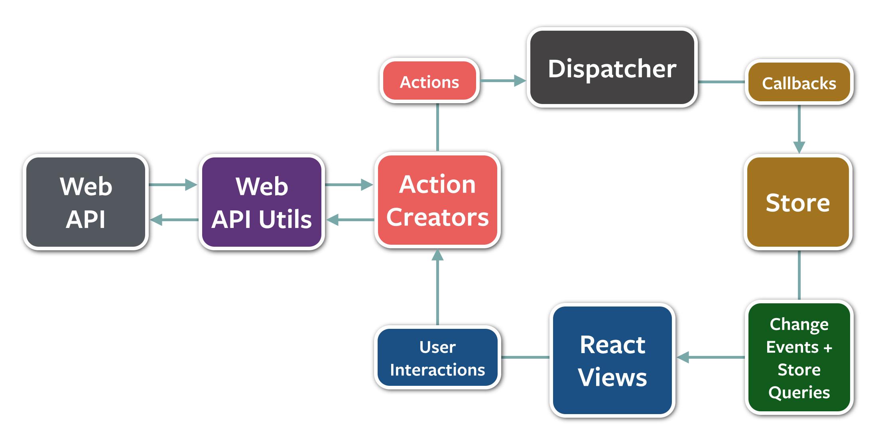

## ⚠️ The Flux project is in maintenance mode and there are many more sophisticated alternatives available (e.g. [Redux](http://redux.js.org/), [MobX](https://mobx.js.org/)) and we would recommend using them instead.

<p align="center">
  
</p>
<h1 align="center">
  Flux
</h1>
<p align="center">
  An application architecture for React utilizing a unidirectional data flow.<br>
  
  <a href="https://github.com/facebook/flux/blob/master/LICENSE">
    
  </a>
  <a href="https://www.npmjs.com/package/flux">
    
  </a>
</p>

<hr/>



## Getting Started

Start by looking through the [guides and examples](./examples) on Github. For more resources and API docs check out [facebook.github.io/flux](https://facebook.github.io/flux).

## How Flux works

For more information on how Flux works check out the [Flux Concepts](./examples/flux-concepts) guide, or the [In Depth Overview](https://facebook.github.io/flux/docs/in-depth-overview).

## Requirements
Flux is more of a pattern than a framework, and does not have any hard dependencies.  However, we often use [EventEmitter](https://nodejs.org/api/events.html#events_class_eventemitter) as a basis for `Stores` and [React](https://github.com/facebook/react) for our `Views`.  The one piece of Flux not readily available elsewhere is the `Dispatcher`.  This module, along with some other utilities, is available here to complete your Flux toolbox.

## Installing Flux
Flux is available as a [npm module](https://www.npmjs.org/package/flux), so you can add it to your package.json file or run `npm install flux`.  The dispatcher will be available as `Flux.Dispatcher` and can be required like this:

```javascript
const Dispatcher = require('flux').Dispatcher;
```

Take a look at the [dispatcher API and some examples](https://facebook.github.io/flux/docs/dispatcher).

## Flux Utils

We have also provided some basic utility classes to help get you started with Flux. These base classes are a solid foundation for a simple Flux application, but they are **not** a feature-complete framework that will handle all use cases. There are many other great Flux frameworks out there if these utilities do not fulfill your needs.

```js
import {ReduceStore} from 'flux/utils';

class CounterStore extends ReduceStore<number> {
  getInitialState(): number {
    return 0;
  }

  reduce(state: number, action: Object): number {
    switch (action.type) {
      case 'increment':
        return state + 1;

      case 'square':
        return state * state;

      default:
        return state;
    }
  }
}
```

Check out the [examples](./examples) and [documentation](https://facebook.github.io/flux/docs/flux-utils) for more information.

## Building Flux from a Cloned Repo
Clone the repo and navigate into the resulting `flux` directory.  Then run `npm install`.

This will run [Gulp](https://gulpjs.com/)-based build tasks automatically and produce the file Flux.js, which you can then require as a module.

You could then require the Dispatcher like so:

```javascript
const Dispatcher = require('path/to/this/directory/Flux').Dispatcher;
```

The build process also produces de-sugared versions of the `Dispatcher` and `invariant` modules in a `lib` directory, and you can require those modules directly, copying them into whatever directory is most convenient for you.  The flux-todomvc and flux-chat example applications both do this.

## Join the Flux community
See the [CONTRIBUTING](/CONTRIBUTING.md) file for how to help out.

## License
Flux is BSD-licensed. We also provide an additional patent grant.
